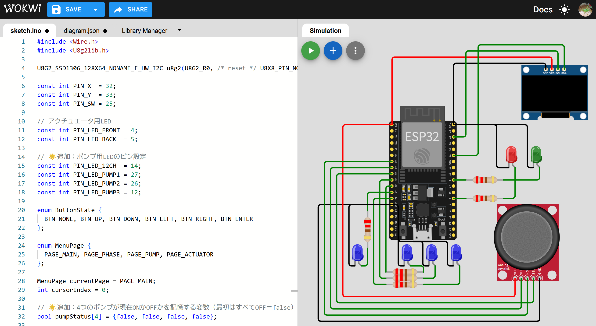
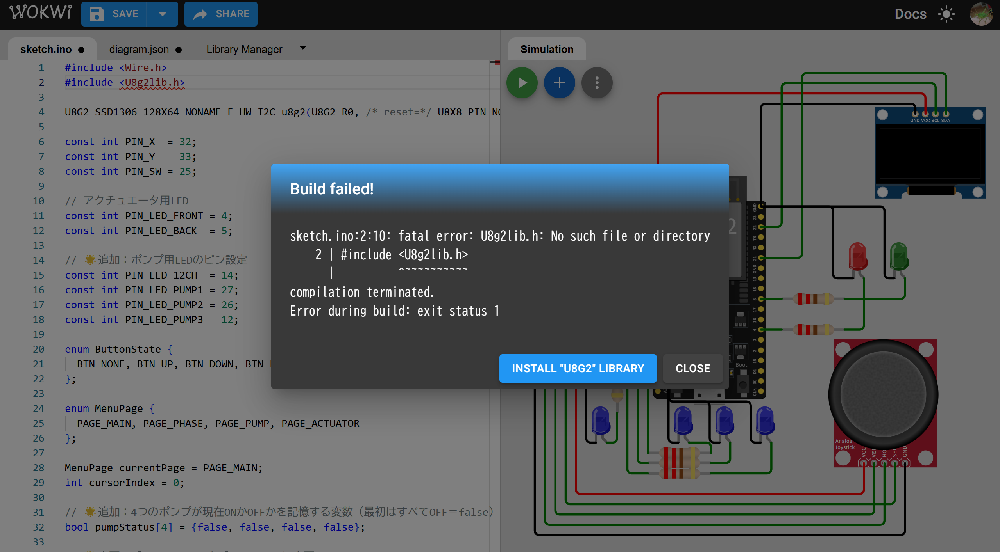
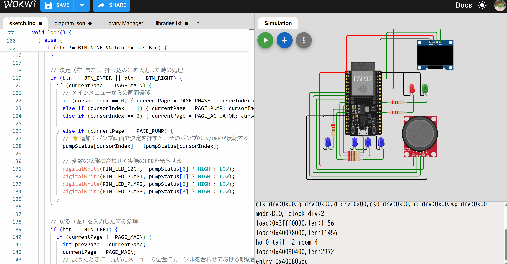

# 使い方
1. [workwi](https://wokwi.com/)にアクセスして、空のESP32プロジェクトを作成
2. 「sketch.ino」タブと「diagram.json」に、このREADME.mdと同じディレクトリにあるプログラムを貼り付け

3. 回路図がある画面の左上にある、緑色の「Start the simulation」ボタンを押す

4. U8G2ライブラリが不足していると言われるので、指示通り「INSTALL "U8G2" LIBRARY」のボタンを押す

5. ライブラリのインストールができたら、改めて「Start the simulation」ボタンを押す。シミュレーションが実行されたら、回路図右側にある5方向スイッチを操作して、画面の操作を体験できる。

